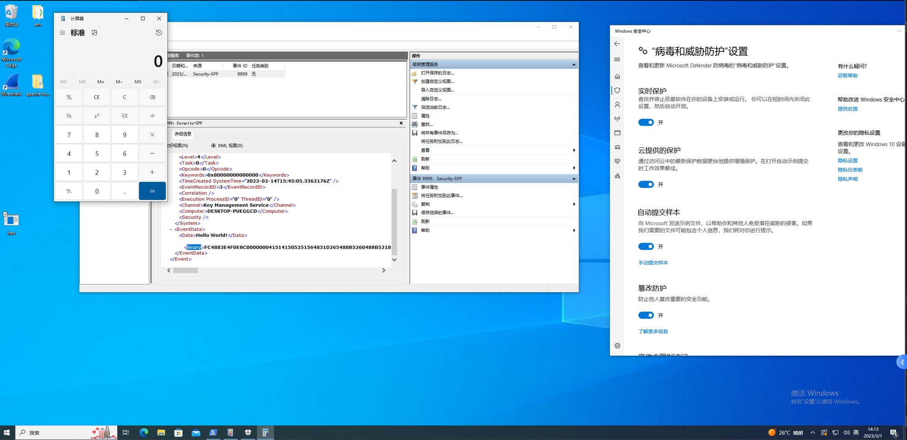
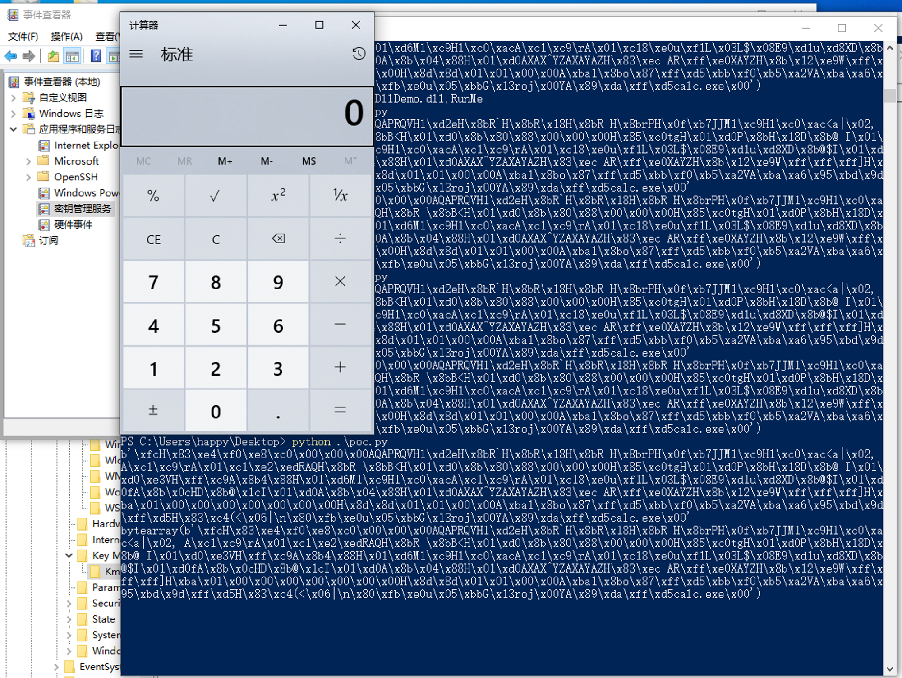

# EventLogPersist
EventLogPersist 是一个对Windows事件日志中“隐藏”的Shellcode进行提取与执行的简单PoC。

下述的例子都已把弹calc的Shellcode写入进事件日志中。程序、脚本都只是对环境中的Shellcode读取并且加载执行，只是简单证明。
其中EventLogPersistA需要编译成可执行文件再运行。执行：

而EventLogPersistB则是一段Python脚本，功能和上者差不多。执行：

图中例子的情况请见：https://mp.weixin.qq.com/s/ggB_XarThtTA_tI44k054w